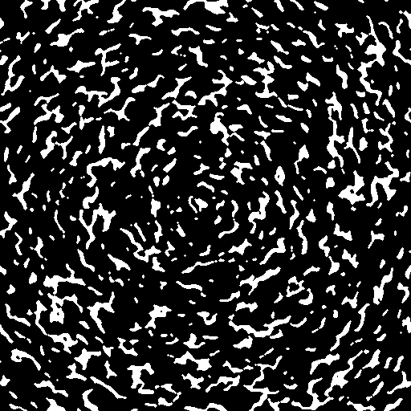
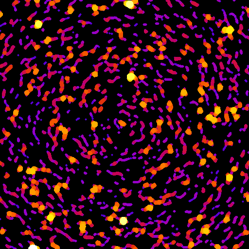
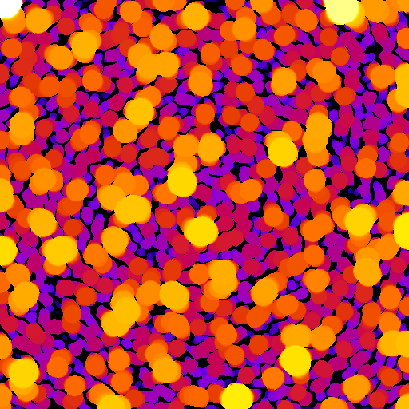
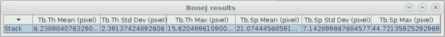

## Introduction
TrabSim is a Python GUI for the generation of syntethic trabecular bone structures with the desired thickness and spacing.

## Trabecular bone model
The trabecular bone model utilised here has been based on the work published in the journal Medical Physics titled [Development of a simple numerical model for trabecular bone structures](https://doi.org/10.1002/mp.13435), where some changes have been implemented in order to simplify the model and make it easier to use, while other changes intend to increase the options available for the generation of the synthetic image.

### Higher-order Gaussian or super-Gaussian function
To add extra flexibility to the model, a more general formulation of a Gaussian function ([super-Gaussian](https://en.wikipedia.org/wiki/Gaussian_function#Higher-order_Gaussian_or_super-Gaussian_function)) with a flat-top and Gaussian fall-off is provided for the enveloping function *M(j,k)* by raising the content of the exponent to a power *m*. For simplicity, the same standard deviation value is used for both coordinate axis, and the offset values are omitted.

![M(j,k)=\exp\left(-\left\[\left(\frac{j}{\sigma}\right)^2-\left(\frac{k}{\sigma}\right)^2\right\]^{m}\right)](https://render.githubusercontent.com/render/math?math=f(j%2Ck)%3D%5Cexp%5Cleft(-%5Cleft%5B%5Cleft(%5Cfrac%7Bj%7D%7B%5Csigma%7D%5Cright)%5E2-%5Cleft(%5Cfrac%7Bk%7D%7B%5Csigma%7D%5Cright)%5E2%5Cright%5D%5E%7Bm%7D%5Cright)).

### Noise distribution
Multiple functions are provided for the noise distribution *N(j,k)* using the [numpy.random](https://docs.scipy.org/doc/numpy-1.13.0/reference/routines.random.html) library:

- Uniform
- Beta
- Normal
- Exponential
- Laplace

### Fourier transform and scaling
The Fourier transform *F* of *N'(j,k)* (the product of *M(j,k)* and *N(j,k)*) was scaled to have unit modulus.

![N'(q,r)=\frac{F\left\[N'(j,k)\right\]}{|F\left\[N'(j,k)\right\]|}](https://render.githubusercontent.com/render/math?math=N%5E'(q%2Cr)%3D%5Cfrac%7BF%5Cleft%5BN%5E'(j%2Ck)%5Cright%5D%7D%7B%7CF%5Cleft%5BN%5E'(j%2Ck)%5Cright%5D%7C%7D).

### Spatial gradient
The spatial gradient, which controls the general shape distribution of the trabecular structure can be turned on or off.

%3D%5Cexp(i%20%5Clambda%20B)),

where

%3D((q%2Bq_0)%5E2%2B(r%2Br_0)%5E2)%5E%7B0.5%7D),

for the ellipsoidal spatial gradient, or

%3D1),

for a trabecular structure without a defined spatial gradient. Finally, the synthetic trabecular structure is generated by:

%2BR(q%2Cr)%7C%5E%7B2%5Ceta%7D).

## Trabecular thickness and spacing
The trabecular thickness and spacing of the generated structures was measured using the [BoneJ](http://bonej.org/) plugin from [Fiji-ImageJ](https://imagej.net/Fiji).

 

## ANN model
To select the appropriate model parameter values for a desired thickness and spacing, a regression analysis was performed by generating synthetic trabecular structures for 300 different samples, with a posterior calculation of the thickness and spacing utilising the BoneJ plugin.

Artificial neural networks (ANNs) with three layers of various sizes were generated and several models were finally chosen according to the R^2 scoring function. The selected models are located in the ANNmodel folder. The ANN implementation was performed using the [scikit-learn neural network library](https://scikit-learn.org/stable/modules/generated/sklearn.neural_network.MLPRegressor.html)

## Graphic user interface

## Prerequisites

* [tifffile](https://pypi.org/project/tifffile/)
* [Tkinter](https://docs.python.org/2/library/tkinter.html)
* [PIL](https://pypi.org/project/Pillow/)
* [OpenCV](https://pypi.org/project/opencv-python/)

## Running the Application
    
    python GUI_ChooseThSp
